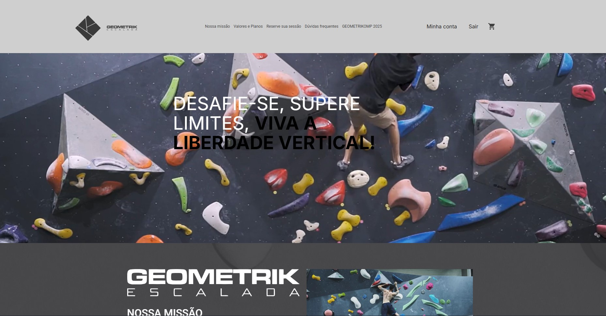
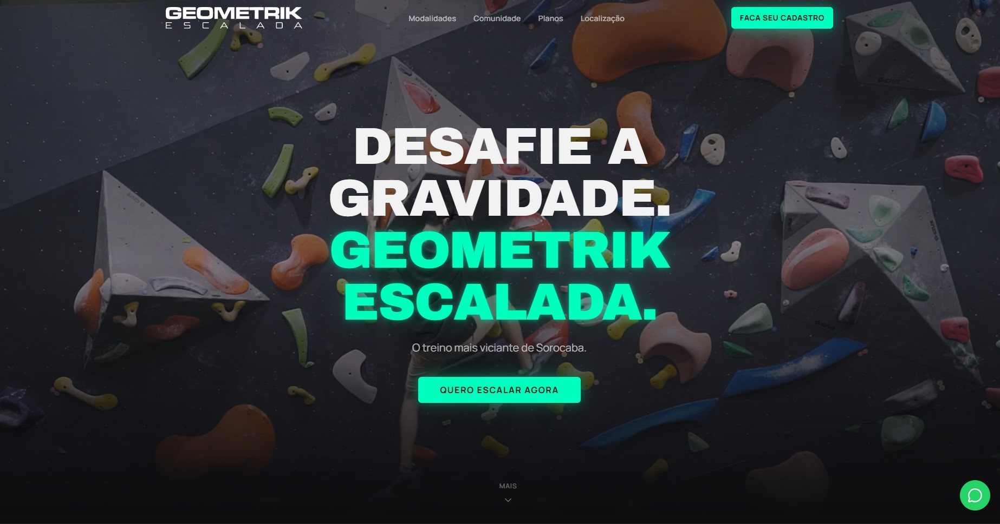

# 🧗 Geometrik Escalada - Redesign Concept


> **Nota:** Este projeto é um *Redesign Conceitual (Case de Estudo)* criado para portfólio. O objetivo foi modernizar a presença digital de uma academia local, transformando um site funcional em uma experiência de marca imersiva.

<div align="center">


[Ver Demo](#) • [Design System](#) • [Contato](#)

</div>

---

## 🎨 O Conceito: "Underground Premium"

A escalada indoor não é apenas um esporte; é um lifestyle. O site original, embora funcional, não transmitia a adrenalina, a comunidade e a energia do local.

Este projeto propõe uma nova identidade visual baseada em **Alto Contraste e Imersão**:
- **Dark Mode Nativo:** Fundo *Charcoal Deep* (#0E0E10) para destacar as fotos vibrantes.
- **Neon Accents:** Uso estratégico de *Ciano Elétrico* (#00FFD1) e *Magenta* para CTAs e feedbacks visuais.
- **Micro-interações:** Hovers, glows e motions que dão vida à navegação.

---

## 🆚 Antes e Depois

| **Site Original (Legado)** | **Novo Conceito (Redesign)** |
|:--------------------------:|:----------------------------:|
|  *Visual corporativo, baixo contraste e foco em texto.* |  *Visual imersivo, foco em conversão e prova social.* |

---

## ⚡ Funcionalidades e UX

### 1. Hero Section Cinematográfica
Substituição de carrosséis estáticos por um **Video Background** com overlay gradiente, focado em retenção imediata e tipografia de impacto (*Archivo Black*).

### 2. Estratégia de Pricing (Ancoragem)
A seção de planos foi redesenhada utilizando psicologia de preços:
- **Destaque Visual:** O plano "Mensal" possui escala maior e brilho neon.
- **Hierarquia:** Planos secundários com opacidade reduzida para guiar a decisão do usuário.

### 3. Prova Social Dinâmica (Marquee)
Um *scroll infinito* (Marquee) mostrando a comunidade real da academia. A ideia é vender o "pertencimento" antes de vender o treino.

### 4. Custom Dark Map
Integração com Google Maps utilizando filtros CSS (`grayscale` + `invert`) para que o mapa não quebre a estética Dark Mode do site, mantendo a harmonia visual.

---

## 🛠️ Stack Tecnológico

- **Framework:** [Next.js 14](https://nextjs.org/) (App Router)
- **Estilização:** [Tailwind CSS](https://tailwindcss.com/)
- **Componentes:** UI construída do zero com base em conceitos do Shadcn/UI.
- **Ícones:** [Lucide React](https://lucide.dev/)
- **Animações:** CSS Keyframes puros (Glow, Float, Marquee).

---

## 🚀 Como Rodar o Projeto

1. **Clone o repositório**
   ```bash
   git clone [https://github.com/seu-usuario/geometrik-redesign.git](https://github.com/seu-usuario/geometrik-redesign.git)